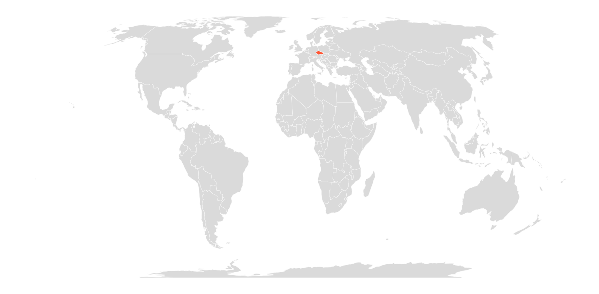
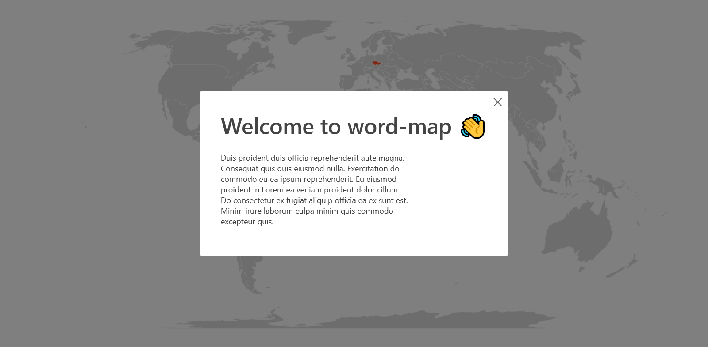

# Welcome to word-map 🌍

> An interactive map for illustrating how something is described in different languages.

Built using [Create React App](https://github.com/facebook/create-react-app), [grommet](https://v2.grommet.io/) and [React Simple Maps](https://www.react-simple-maps.io/)

*More screenshots [here](#Screenshots)*

## Data

The map data is pulled from `public/data.json`.

## Customization

### Welcome Dialog

Content of the welcome dialog is pulled from `public/welcome.md`.

### Colors

You may adjust the colors in `src/index.js`. 
See [grommet](https://v2.grommet.io/) documentation for more info.

## Screenshots

